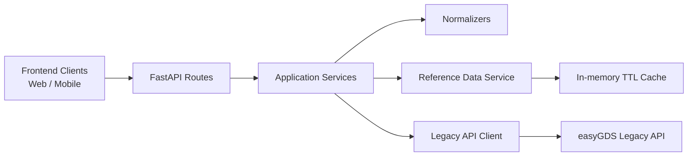

# Assessment Notes

## 1. API Design Decisions

### Why FastAPI

FastAPI is a better fit than Django for this project because the problem is mostly asynchronous HTTP orchestration, validation, transformation, and documentation generation. There is no database-backed domain model or admin workflow here, so Django would add framework weight without solving the hard part of the assessment.

FastAPI gave the implementation:

- typed request and response models
- automatic OpenAPI and Swagger generation
- straightforward async route handlers
- low-friction middleware and lifecycle wiring

### Why REST

REST is the right choice for this wrapper because the public surface area is small and stable:

- flight search
- offer details
- create booking
- retrieve booking

The upstream system is already REST-based, and the frontend requirements did not call for arbitrary field selection or complex graph traversal. REST kept the public API simpler to document, easier to test, and easier to reason about during transformation.

### URL and Schema Design Philosophy

- Public endpoints are versioned consistently under `/api/v1`.
- Public payloads use camelCase.
- Internal Python code uses snake_case and converts at the boundary through Pydantic aliases.
- Request payloads are stricter than the upstream contract.
- Response payloads are flattened for frontend rendering rather than mirroring upstream nesting.

### Error Response Structure

Every downstream error is normalized to:

```json
{
  "error": {
    "code": "BOOKING_NOT_FOUND",
    "type": "not_found",
    "message": "Booking UNKNOWN123 not found",
    "status": 404,
    "requestId": "b4b94c1f-5277-4d1c-9c57-9be2019361c0"
  }
}
```

This hides the upstream's incompatible formats:

- `{"error": {"message": "...", "code": N}}`
- `{"errors": [{"code": "...", "detail": "..."}]}`
- `{"fault": {"faultstring": "...", "faultcode": "..."}}`
- `{"status": "error", "msg": "..."}`

### Upstream-to-Downstream Transformation

The transformation layer intentionally does not expose the upstream shape directly.

Key normalization rules:

- drop duplicate keys such as `offer_id` and `offerId`
- prefer canonical numeric values over string copies
- flatten nested segment structures into UI-ready segment lists
- normalize all datetimes to ISO 8601 with offsets where applicable
- normalize date-only values to `YYYY-MM-DD`
- enrich codes with labels for airlines, cabins, payment methods, passenger types, and statuses
- enrich airport outputs with city and timezone data where possible
- paginate search results locally because the upstream returns all results in one response

## 2. Architecture Overview



### Layer Boundaries

- `app/api/`: validates requests, exposes response models, sets transport-level behavior like `X-Cache`
- `app/services/`: orchestrates each endpoint use case
- `app/services/normalizers.py`: converts raw upstream payloads into frontend-facing shapes
- `app/services/reference_data.py`: airport enrichment and cached airport lookup behavior
- `app/clients/legacy_api.py`: owns retries, timeout handling, circuit breaker, and error translation
- `app/core/`: shared config, date parsing, caches, code maps, and error types

### Codebase Structure

- `app/main.py`: app creation, middleware, dependency wiring
- `app/models/api.py`: public schemas and Swagger examples
- `tests/fixtures/upstream/`: captured upstream payloads used as golden fixtures
- `tests/test_api.py`: endpoint behavior and resilience tests
- `tests/test_dates.py`: datetime normalization tests
- `tests/test_normalizers.py`: response transformation tests

## 3. Resilience Patterns

### Upstream Slowdowns and Timeouts

The client uses explicit connect and read timeouts via `httpx`. When the upstream times out, the wrapper converts that into a normalized `504` error with code `UPSTREAM_TIMEOUT`.

### Retries

Retries are applied only to safe, idempotent reads:

- flight search
- offer details
- airport list/detail lookups
- booking retrieval

Retries are triggered on:

- upstream timeout
- `429`
- upstream `5xx`

The implementation uses exponential backoff with jitter through `tenacity`.

### No Retry on Booking Creation

Booking creation is intentionally not retried. A second POST could create a duplicate booking, which is a worse failure mode than surfacing a single upstream error.

### Circuit Breaker

The upstream client includes a lightweight circuit breaker. After repeated upstream failures, the breaker opens and the service returns `503 UPSTREAM_UNAVAILABLE` immediately until the recovery window expires.

### Unexpected Upstream Shapes

If the upstream returns malformed JSON or an unexpected payload type, the wrapper returns a normalized `502` error rather than leaking raw upstream behavior.

### Partial Enrichment Failure

Airport enrichment is treated as best effort. If airport city lookup fails, the endpoint still succeeds and falls back to the raw airport code instead of failing the entire request.

## 4. Caching Strategy

### What Is Cached

- airport reference data: 24 hours
- booking retrieval summaries: 60 seconds

### Where Caching Sits

Caching sits in the service layer behind a small in-memory TTL store wrapper. Route handlers do not know whether the cache is in-memory or remote.

### Why These Choices

- airport data is stable enough to tolerate a long TTL
- booking retrieval is a good demo candidate because consumers often refresh booking status shortly after creation
- short TTL on bookings avoids serving stale data for too long while still demonstrating the cache hit path

### Invalidation Behavior

- airport entries expire on TTL
- booking retrieval entries expire on TTL
- successful booking creation seeds the booking cache with the normalized booking summary

### Future Evolution

The cache wrapper is intentionally small so Redis or another shared cache can replace the in-memory implementation later without changing route logic.

## 5. AI Workflow

### Tools Used

- Github Copilot subscriptions
- Opencode for agentic development and codebase-awareness edit
- the provided upstream OpenAPI document
- live sample responses from the mock upstream API to verify undocumented success payloads

### Where AI Accelerated Delivery

- generating the initial FastAPI project structure
- drafting normalization models and service boundaries quickly
- turning live upstream payloads into deterministic test fixtures
- producing the first pass of API and unit tests

### Where I Had To Intervene

- datetime normalization required manual reasoning because the upstream mixes:
  - ISO timestamps with offsets
  - human-readable strings like `15-Apr-2026 12:50 PM`
  - compact timestamps like `20260415145300`
  - Unix epoch seconds
- error normalization needed explicit mapping rules because each upstream endpoint family reports errors differently
- Swagger examples needed explicit schema examples because autogenerated defaults were too generic for demo purposes

### Validation Approach

- captured representative live upstream payloads into fixtures
- validated transformations with unit tests
- validated endpoint contracts with FastAPI tests using mocked upstream transport
- validated resilience paths for timeout, `429`, and circuit-breaker behavior
- added an opt-in E2E layer that runs the BFF over real HTTP against the live mock upstream

## 6. Setup Instructions

1. Create and activate a Python 3.12 virtual environment.
2. Install dependencies with `pip install -e '.[dev]'`.
3. Start the API with `uvicorn app.main:app --reload`.
4. Open `/docs` for Swagger UI and `/openapi.json` for the generated schema.
5. Run `pytest` to validate the implementation.
6. Run `RUN_E2E=1 pytest -m e2e` to execute the live end-to-end suite.

### E2E Test Notes

- E2E tests are marked with `@pytest.mark.e2e`
- they are skipped during a normal `pytest` run unless `RUN_E2E=1` is set
- if `E2E_BASE_URL` is not provided, the test suite starts the BFF locally with `uvicorn`
- if `E2E_BASE_URL` is provided, the suite targets that running instance instead
- the E2E flow currently covers search, offer lookup, booking creation, booking retrieval, and unified offer-not-found behavior

## 7. Delivered Endpoints

### `POST /api/v1/flights/search`

- accepts a simplified search payload
- calls the upstream search endpoint
- flattens results into `items[]`
- adds local pagination
- enriches airport and carrier labels

### `GET /api/v1/offers/{offerId}`

- returns normalized fare-family, policy, baggage, condition, and payment data
- normalizes timestamps

### `POST /api/v1/bookings`

- validates contact and passenger input more strictly than upstream
- maps clean frontend input to the upstream booking shape
- returns a normalized booking summary

### `GET /api/v1/bookings/{bookingReference}`

- returns the same booking summary shape as booking creation
- demonstrates cache behavior via `X-Cache: MISS|HIT`

## 8. Testing Summary

Automated tests currently cover:

- datetime parsing across the observed upstream formats
- offer and booking normalizers
- search pagination and transformation
- unified search, offer, and booking errors
- booking validation failure behavior
- cache hit/miss behavior on booking retrieval
- timeout, rate-limit, and circuit-breaker scenarios
- an opt-in live E2E path through the wrapper and the external mock upstream
